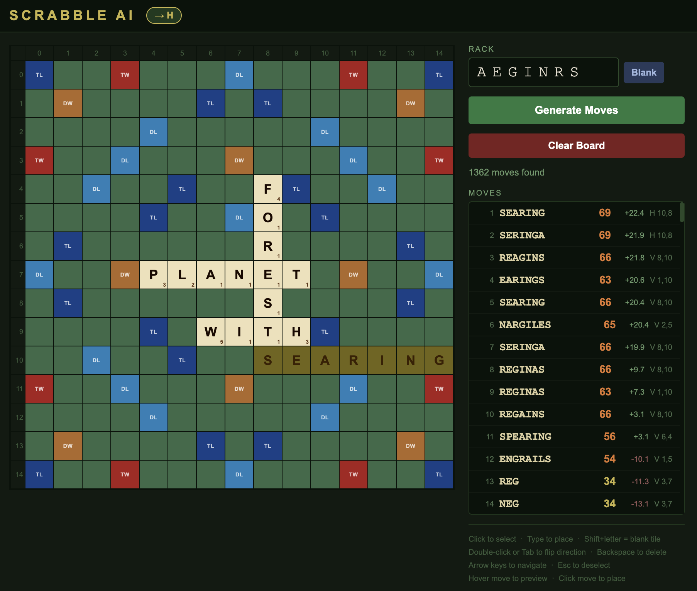

# Scrabble AI

A Scrabble engine that finds every legal move on the board and ranks them with a neural network trained on self-play. It comes with a small web app: set up a board and rack, and see the best plays for any game you are currently playing (it uses the same board as Crossplay from NYT)!

<p align="center"></p>

## How it works

**1. Move generation (GADDAG).** The dictionary is compiled into a [GADDAG](https://en.wikipedia.org/wiki/GADDAG), a trie variant that stores every word once for each possible starting point, so the generator can grow words in both directions from any anchor square. Together with precomputed cross-checks, this lets the solver list every legal play for a rack, blanks included, in one pass.

**2. Move evaluation (policy network).** The highest-scoring move is sometimes not the best one: a good player also weighs the tiles left on the rack (the "leave"), what the move opens up for the opponent, and the game state. A hybrid PyTorch network scores each candidate move:

- a **CNN branch** reads the board after the move as a 33-channel 15×15 tensor: letters, blanks, premium squares, newly placed tiles and anchor squares
- an **MLP branch** reads 64 hand-built features: leave composition, unseen tiles, move score, position, turn number and the score difference
- the two branches are fused into one output: the predicted **discounted score margin** for the rest of the game

The network has about 200k parameters and scores a batch of candidates on CPU in well under 100 ms.

**3. Lookahead.** The app reranks the model's top 10 moves with a one-step expectiminimax search. For each candidate it samples racks the opponent could hold from the unseen tiles and finds their best reply, then blends that result with the model's estimate. Near the endgame, when few tiles are unseen, it enumerates every possible opponent rack instead of sampling.

## Training

The model was trained by distributed self-play on a shared CPU cluster:

- **Workers** (12–16 processes, [`start_workers.sh`](start_workers.sh)) play complete games against a greedy opponent (one that always plays the highest-scoring move). Each move is labeled with the discounted score differential over the following turns.
- **The trainer** ([`ai/training/trainer.py`](ai/training/trainer.py)) loads finished games into a 100k-transition replay buffer, trains with AdamW, saves a checkpoint for the workers to pick up, and evaluates against the greedy baseline every 2,000 games (50 games per evaluation).
- Training moves from Phase 1 (vs. greedy) to Phase 2 (self-play) once the win rate stays above 72%.

### Results


In the final overnight run (exponential learning-rate decay, shown above), the model went from about 20% wins against the greedy player to winning **55–65% of games with an average margin of +15 to +20 points**, peaking at 76% in a single 50-game evaluation. An earlier constant-learning-rate run (`data/training_logs/lr=1e-4/`) peaked early and then degraded overnight. That run is why the final run used a decaying learning rate.

## Running it

```bash
python -m venv .venv && source .venv/bin/activate
pip install -r requirements.txt

python app.py                    # serves http://127.0.0.1:8080
```

On first launch the app builds the GADDAG from `data/wordlist.txt` (TWL06) and caches it as `data/gaddag.pkl` (~95 MB). Later launches load the cache. The trained checkpoint is included at `data/model.pt`. If it's missing, the app falls back to ranking moves by raw score.

### Training your own model

```bash
bash start_workers.sh            # self-play workers -> data/transitions/
python -u -m ai.training.trainer --model-path data/model.pt \
    --transition-dir data/transitions/ --gaddag-path data/gaddag.pkl \
    --log data/training_logs/training_log.csv
python data/analysis/plot_live.py   # live training plots
```

## Project layout

```
gaddag/          GADDAG construction and serialization
solver/          board, premium squares, scoring, move generator
ai/model/        feature extraction, policy network, batched inference
ai/training/     self-play workers, replay buffer, trainer
ai/lookahead.py  one-step expectiminimax reranking
app.py           Flask server; templates/index.html is the board UI
tests/           move generator, cross-check and duplicate-move tests
```
